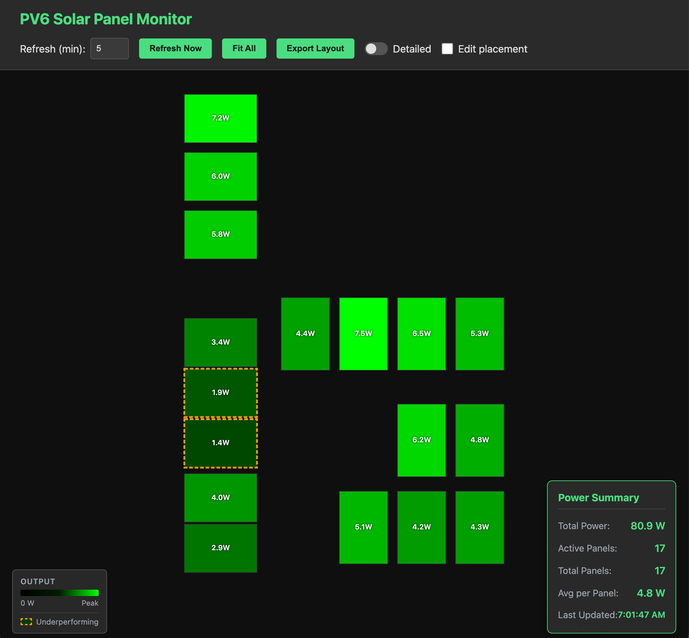
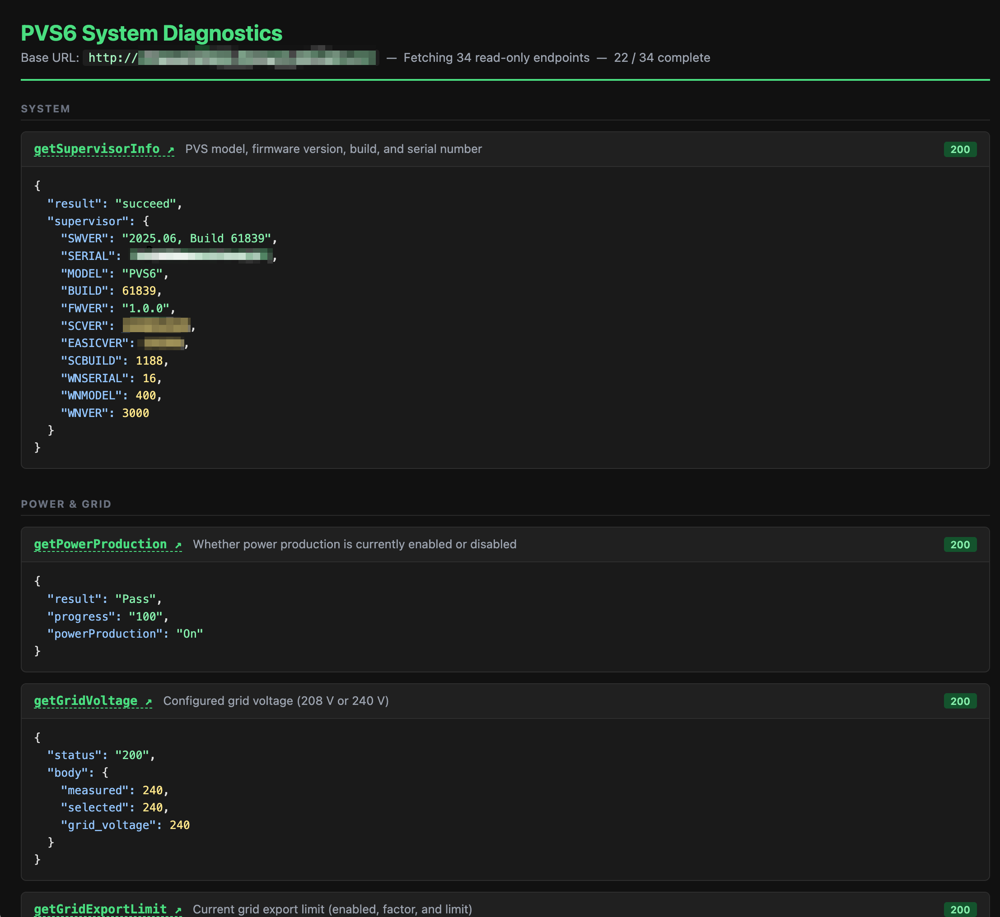

# SolarPaneler

Render SunPower PVS6 Solar Panels in your browser, ~~automatically finding the placement of your panels~~ and
showing power production and panel details for each. Includes handy access to detailed diagnostics of
your PVS6 system.

Detailed post at [Self Hosting PVS6 Monitoring (software included!)](https://brett.durrett.net/self-hosting-pv6-monitoring-software-included/)



## Requirements

You need to get network connectivity to your PVS6 (see blog post above for tips). 

This update supports the SunStrong firmware changes, tested with 2025.10, Build 61846, but probably works
with anything after 2025.06, Build 61839. Due to chnages with the PVS6 serving, it is no longer possible
to run this as 100% standalone webpage, it will require running from a server that has access to the PVS6.
Currently some functionality is limited, notably the automatic reading of the panel layout (it looks like
SunStrong requires installer-level access to read this now 😒), so you can still manually set your layout.

The current update is still very much a work in progress in migrating to the SunStrong API.

Previous versions of this app make the calls to the PVS6 directly from the web browser (no server 
is needed at all), and that means the device running the browser must be able to reach the PVS6 on 
the network). Do to changes from SunPower / SunStrong, this only works with firmware 2025.06, Build 61839
and earlier (pull earlier versions of this app if that is your firmaware)


## Setup

1. Copy the example configuration file:
   ```bash
   cp config.example.js config.js
   ```

2. Edit `config.js` and update the URLs with your actual API endpoints:
   - `apiBaseUrl`: Base URL for your solar panel API
   - `panelLayoutEndpoint`: Endpoint path for panel layout data
   - `powerDataEndpoint`: Endpoint path for power data

Note: `config.js` is ignored by git, so each installation can have its own configuration.

## Running

Just load index.html into a browser... no server needed!

## Panel Layout Export/Import

Upon page load, the panel layout will be determined using the `getPanelsLayout` operation from the PVS6. This is supposed to
get the layout data from `The panels layout, from EDP with fallback to the one stored on the PVS` but I have found this
fallback time to be infinite, so you will likely need to allow the PVS6 to access the Internet to get your initial panel 
layout, which you can then export so the PVS6 will not require future access to the Internet. 

You can export the panel layout (including any manual position adjustments) and use it locally instead of fetching from the API.
This will make the initial page load faster and provides a solution for layouts being inaccurate or inaccessible.

### Exporting the Panel Layout

1. Load the application and arrange your panels as desired (you can drag panels to reposition them)
2. Click the **"Export Layout"** button in the header
3. The layout will be:
   - Copied to your clipboard
   - Downloaded as a text file (`panel-layout-export.txt`)

### Using the Exported Layout

1. Open the exported file or paste the clipboard content
2. Open your `config.js` file
3. Find the `localLayout` property (it should be set to `null`)
4. Replace `null` with the exported array from the file

Example:
```javascript
const CONFIG = {
    apiBaseUrl: 'http://127.0.0.1',
    panelLayoutEndpoint: '/cgi-bin/dl_cgi/panels/layout',
    powerDataEndpoint: '/cgi-bin/dl_cgi?Command=DeviceList',
    
    // Paste your exported layout here:
    localLayout: [
        {
            "id": "panel-1",
            "x": 50,
            "y": 50,
            "width": 80,
            "height": 120,
            "planeRotation": 0,
            "inverterSerialNumber": "SN123",
            "serialNumber": "SN123"
        },
        // ... more panels
    ]
};
```

5. If desired, change the value of `id` to a friendly name (defaults to serial number)
6. Save `config.js` and refresh the application
7. The app will now use the local layout instead of fetching from the API

**Note:** When `localLayout` is configured, the app will skip fetching the panel layout from the API, which can be useful for:
- Offline use
- Custom panel arrangements
- Faster loading times
- Preserving manual position adjustments

## Diagnostics
The diagnostics button pops-up a seoarate window with a lot of setails of your system (currently reading
34 endpoints) for things like accessPoints, device details, software versions, network interfaces, etc. If 
any diagnostic doesn't update, it may require PV6 Internet access and you may need to (at least temporarily)
unblock any firewall (for example, panel layout appears to require Internet access).




